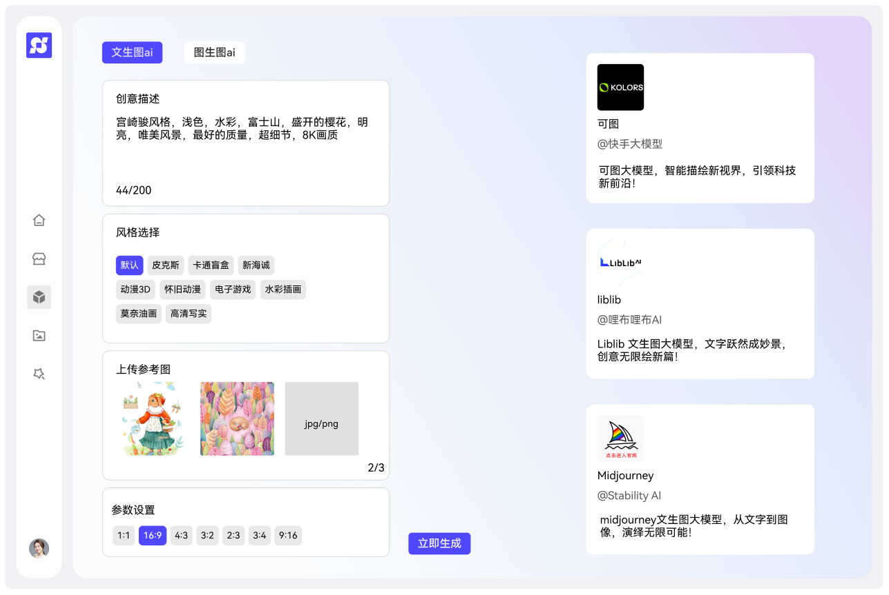
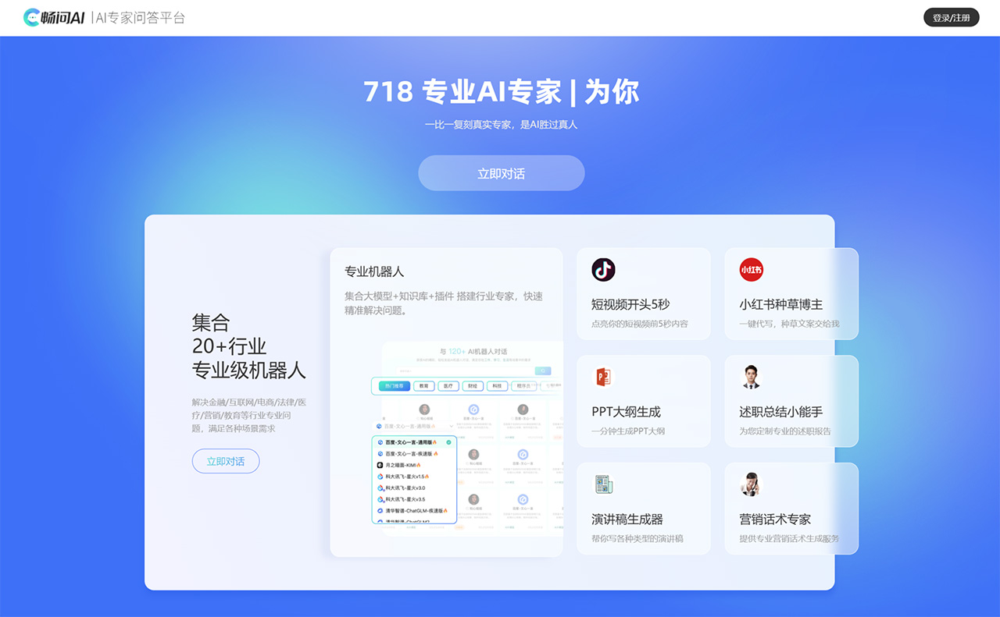
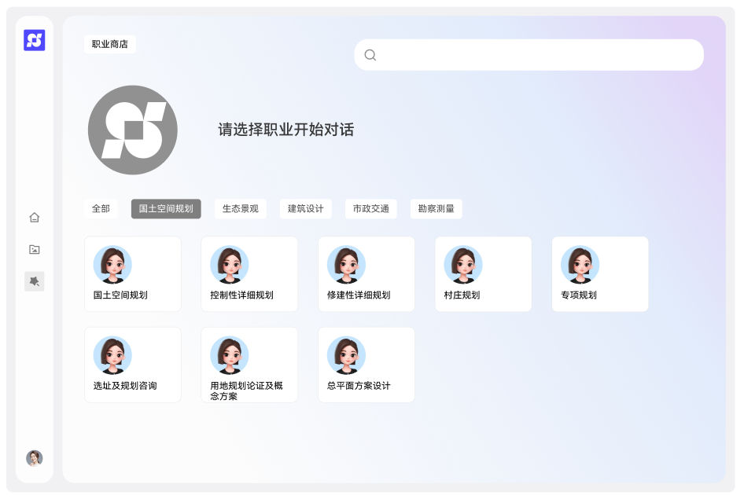

# 平台建设背景与目标

## 建设背景

&emsp;&emsp;在当今科技飞速发展的时代，AI 领域正经历着令人瞩目的变革，近来来，随 chatgpt 横空出世，AI 技术呈现出爆发式的发展态势，各类创新成果层出不穷。
&emsp;&emsp;AI 如同一场汹涌的浪潮，席卷了众多传统行业。它以其强大的数据分析和智能处理能力，重塑了传统行业的运营模式和业务流程。从制造业到服务业，从医疗领域到金融领域，AI 的应用无处不在，为传统行业带来了前所未有的机遇和挑战，推动着传统行业不断迈向新的高度。
&emsp;&emsp;而在规划设计行业，一直以来都严重依赖于精准的数据进行决策。过去，数据的收集和分析往往耗时费力且存在诸多局限性。然而，大数据和 AI 的出现为这个行业注入了新的活力。它们不仅能够快速整合海量的相关数据，还能通过智能算法进行深度分析和模拟预测，为规划设计提供了全新的思路和方法。这极大地提高了规划设计的效率和质量，让设计师们能够更加精准地把握项目需求，创作出更具创新性和可行性的方案。

## 建设目标

1. 打造集团内部的 AI 访问体系

&emsp;&emsp;致力于打造一个高效的 AI 访问体系，让集团内部各专业院和本部能够轻松便捷地触及 AI 资源，享受安全流畅的 AI 访问路径。无论是日常的业务分析、方案策划还是创新研究，都能随时借助强大的 AI 工具实现效率的提升，为各部门的工作开展提供坚实的技术支撑。

2. 为集团自研 AI 大模型奠定基础

&emsp;&emsp;积极筹备为自研 AI 大模型创造有利条件。通过不断积累技术经验、数据资源和人才力量，逐步构建起具有自主知识产权和核心竞争力的 AI 大模型。这不仅将提升集团在 AI 领域的影响力和话语权，还能为未来的多元化发展提供无限可能。

3. 通过专业领域模型提高专业效率

&emsp;&emsp;着重开发专业领域模型，以精准满足各专业工作的特殊需求。针对不同专业的特点和业务流程，深入研究并构建专属的 AI 模型。当集团人员在进行专业领域相关提问时，通过不断的训练和优化，AI 能够精准理解并快速给出高质量的解答，从而大幅提高专业工作的效率和质量。让每一个专业领域都能在 AI 的助力下实现新的突破和跨越，推动集团整体业务向更高水平迈进。

# 主要功能

1. AI 生成式对话
   
   - 功能
     
     - 知识解答：对于用户提出的科学、历史、文化、技术等各种领域的问题，尽力给出准确和详细的答案。
     - 语言学习帮助：辅助用户学习和提升语言能力，包括语法讲解、词汇解释、翻译等。
     - 文案创作：根据用户的需求创作各种类型的文案，如广告文案、故事、诗歌等。
     - 情感交流：倾听用户的心声，为用户提供情感上的支持和建议。
     - 逻辑推理和分析：帮助用户分析复杂的问题，梳理思路，做出合理的判断。
   
   - 模型选择
     
     - 使用五个模型，模型暂定为 qwen-plus、Doubao-pro-32k、混元-pro、ERNIE 4.0、星火大模型V3.5
     - 均采用国内知名厂商提供的模型，具有无政治风险、网络访问稳定、默认中文语义、开发者文档丰富的优点

2. AI 文生图、图生图
- 文生图（txt2img）：文生图任务是指将一段文本输入到SD模型中，经过一定的迭代次数，SD模型输出一张符合输入文本描述的图片。
- 图生图（img2img）：图生图任务在输入本文的基础上，再输入一张图片，SD模型将根据文本的提示，将输入图片进行重绘以更加符合文本的描述。

<!--  -->

3. AI 精准行业专家级解答
- 精准专业的答案：每一个问题，都从专业的知识库中获取答案，确保准确性和专业性。
- 知识实时更新：专家智库会根据最新研究和市场动态实时更新，为用户提供最前沿的专业知识和解决方案。
- 全领域覆盖：从国土空间规划、生态景观、市政交通，所有规划行业相关，都能提供专业的解答。

<!--  -->

# 费用测算

## 对话类费用

&emsp;&emsp;以一人一天输入 1k tokens, 输出 20k tokens, 购买一个 API 实例, 一天使用人数 20 人, 一年 260 个工作日为例进行估算， 累计输入 1 * 20 * 260 = 5200 k token, 累计输出 20 * 20 * 260 = 104000 k token， 经由 https://top.aibase.com/ranking/llmapi 测算， 得出表格

| 模型名称             | 厂商         | 价格      |
|:----------------:|:----------:| -------:|
| yi-34b-chat-200k | 零一万物       | 1310.4元 |
| qwen-plus        | 阿里云        | 1268元   |
| 星火大模型V3.5        | 讯飞星火       | 3603.6元 |
| 混元-pro           | 腾讯云        | 10556元  |
| ERNIE 4.0        | 百度智能云      | 13104元  |
| GLM-4-0520       | 智谱AI       | 10920元  |
| Doubao-pro-32k   | 字节跳动       | 212元    |
| gpt-4-32k        | OpenAI(国外) | $12792  |
| Gemini 1.5 Pro   | Google(国外) | $2220.4 |

选购 qwen-plus、Doubao-pro-32k、混元-pro、ERNIE 4.0、星火大模型V3.5， 总费用为 1268 + 3603.6 + 10556 + 13104 + 212 = 28743.6 元

## 文生图费用

&emsp;&emsp;抛开与平台强绑定的产品，如可灵AI(快手)、即梦AI(抖音)，具备API能够供给接入调参的屈指可数。图像生成的费用方式一般分为预付费与后付费，前者按年或按月计费，类似流量包，后付费各家收费不一，但基本在 0.3元/张，按量付费。
&emsp;&emsp;可以先试水按量付费或者购买 腾讯文生图轻量版年包，这样费用较低，等使用人数多了再考虑转为年包付费。

| 产品     | 厂商  | 付费模式                      | 内容      |
| ------ | --- | ------------------------- | ------- |
| AI作画   | 百度  | 预付费: 年费3200元, 后付费: 0.3元/张 | 含 2万张图片 |
| 混元生图   | 腾讯  | 预付费: 年费3500元, 后付费: 0.3元/张 | 含 1万张图片 |
| 文生图轻量版 | 腾讯  | 预付费: 年费 900元, 后付费: 0.1元/张 | 含 1万张图片 |

## 其他费用

- 硬件成本：在不训练模型的情况下，没有硬件成本
- 部署成本：公司现有阿里云主机两台，25年3月到期，可将应用部署到上面
- 开发成本：公司现有专职后端一人，专职前端两人，工期暂定两个月，人员成本暂忽略。

&emsp;&emsp;因笔者没有关于 AI 的从业经验，对于 AI 接口的接入难度和实现路径，无法完全评估准确，费用估算仅供参考，以上估算均为单个实例的费用，实际使用可能会碰到性能不足需增加实例的情况，费用会根据使用人数、模型选择、实例数量而变化。
&emsp;&emsp;仅以小试牛刀，制作一个 MVP（最小化可实行产品，Minimum Viable Product）的角度来看，人民币 3 万元可以试个水。
